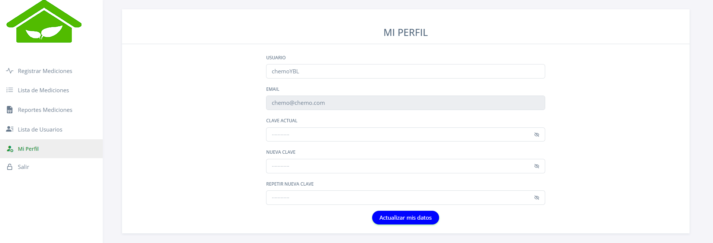

# PYTHON CON FLASK, SQL SERVER, ARDUINO, SOCKET, HTML, JS, CSS

## Instalaciones

- Crear y activar el entorno virtual.
- Instalar los paquetes indicados en el archivo Requirements

```sh
# Instalar entorno virtual
py -m venv env
# Activar entorno virtual
.\env\Scripts\activate
# Instalar los paquetes indicados en el Requirements
pip install -r requirements.txt
```

## FORMULARIOS

Login


Crear Cuenta


Dashboard


Registrar Medición


Lista Medición


Lista Usuario


Perfil


